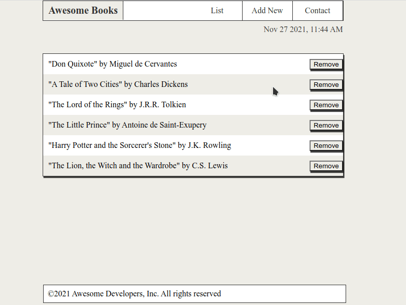

# Awesome Books

> "Awesome books" is basic website that allows users to add/remove books from a list using JavaScript objects and arrays.

## Built With

- Html
- JavaScript

## Live Demo

[Live Demo Link](https://fabgrel10.github.io/awesome-books/)

## Getting Started

To get a local copy up and running follow these simple example steps.

- Click on the top right green "code" button.
- On the dropdown menu, choose "download with zip" button.
- After download, extract the zip file and you have the project running on your machine.

## Authors

👤 **Fabricio Garcia**

- GitHub: [@fabgrel10](https://github.com/fabgrel10)
- LinkedIn: [fabgrel10](https://www.linkedin.com/in/fabgrel10/)
- Twitter: [@fabgrel10](https://twitter.com/fabgrel10)

👤 **Alvaro Ruiz**

- GitHub: [@alvarorf](https://github.com/alvarorf)

## 🤝 Contributing

Contributions, issues, and feature requests are welcome!

Feel free to check the [issues page](../../issues/).

## Show your support

Give a ⭐️ if you like this project!

## Acknowledgments

- Hat tip to anyone whose code was used

## 📝 License

This project is [MIT](./MIT.md) licensed.
